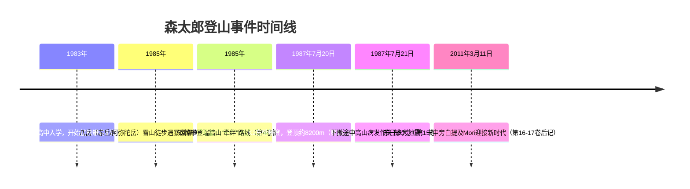

> summary
{: .prompt-info }

日文原著新田次郎《孤高の人》
## 读后感

这是一本关于一位登山家的故事的漫画，但它不仅仅讨论的是登山，更是人的意义的探寻，人在自然之前的勇气、在社会丛林中寻找同伴、在孤岛中寻求认同。

森文太郎从一开始就表现的孤僻阴郁的气质，伴随着激进的行为，能够让人感受到一种亡命之徒的气质，或者是求生欲极低的感觉。随着剧情推进慢慢有人接受了他，但是再次被命运摧毁这种关系，从未完全说明的前情，一直到最后的单行本18卷，一直都维持了这样的节奏。

说实话，如果试着去带入主角，确实会产生一种沉重的，让人喘不过气的压抑感，在这个社会丛林之中，没有任何的归属感，自己只会带来不幸，只想远离人群，只要进入到山林之中，就可以褪去自己的人性，那是只有野兽才能身存的地方，只有那样才能被山神所接受。但是最原始的欲望和人性终究还是存在的。但是我带入之后感受到那种决绝之后就会马上抽身而出，因为我想象不出来遭遇哪些情况下我会怎么面对，更别说有一个一直追逐的目标

总之我觉得这部作品的对人物的表现很优秀，不管是画工还是故事，其中的登山者的人格魅力过于强了，当然人物也足够立体，每一个配角的欲望和执着的展现也是淋漓尽致，最让我产生共鸣的是关于那个接触到山的某一瞬间的感受，那种从窒息的社会中逃离的感觉。非常推荐阅读，也许让你触动的会是另一个瞬间。

这本漫画也科普了很多登山相关的知识。

## 科普

### 登山相关术语清单

| 术语                            | 日文原文          | 中文释义                                          | 使用场景及重要性说明                                               |
| ----------------------------- | ------------- | --------------------------------------------- | -------------------------------------------------------- |
| **头盔**（helmet）                | ヘルメット         | 保护头部的安全装备，用于抵御落石、碰撞等危险。                       | 保护登山者头部安全，几乎所有登山活动必备。在高山和岩壁攀登时尤为重要。                      |
| **安全带**（harness）              | ハーネス          | 固定在腰部与腿部的安全带，攀登时将其与绳索连接以保护攀登者。                | 攀岩/登山中保护攀登者坠落的重要设备。在小说中，领攀与被保护者会通过安全带和绳索紧密相连。            |
| **绳索**（rope）                  | ザイル           | 攀登用的高强度绳索，用于保护、攀援和下降。                         | 核心装备，用于与安全带连接形成保护体系，可作为固定支点和下降辅助。固定绳（固定繩）沿路线预先打设，辅助攀登。   |
| **快挂**（quickdraw）             | クイックドロー／ヌンチャク | 由两头带快挂扣的扁带（吊带）组成的连接件，一端夹在岩钉或冰锥等锚点上，另一端与攀登绳挂接。 | 方便快速挂接绳索与固定点，以缩短攀岩过程中的挂接时间。是岩壁多段攀登（multi-pitch）的常用装备。    |
| **钛扣/登山扣**（carabiner）         | カラビナ          | 铝制或钢制的大D形金属扣环，用于连接绳索与其他装备。                    | 基本连接件，用于连接绳索、扁带、保护器等。在构筑保护点和吊挂设备时不可或缺。                   |
| **冰镐**（ice axe / ice pick）    | アイスアックス／ピッケル  | 雪地和冰壁行进时用来开凿雪洞、制动雪崩或攀爬的冰斧。通常一端带尖刃。            | 在雪山和冰川中攀行的重要工具，用以稳定行走和自我保护。亦可支撑锚固冰雪路段。                   |
| **冰锯**（ice saw）               | アイスソー         | 专为冰岩攀爬设计的锯状工具，用于锯断冰层，制作冰楔等。                   | 主要用于高山雪崩救援或制作冰锥锚点时锯断大块冰层，提高攀登效率与安全。                      |
| **冰爪（冰爪）**（crampons）          | アイゼン          | 固定于登山鞋底部的金属爪，增加行走或攀冰时的抓地力。                    | 在冰雪山地行进时用于提高鞋底抓地力，防滑必备。尤其在冰瀑和陡峭雪坡上作用突出。                  |
| **攀岩鞋**（rock climbing shoes）  | クライミングシューズ    | 专用登岩鞋，鞋底贴合脚型、材质柔软，提供摩擦力以攀爬岩石。                 | 主要用于岩壁攀爬，提供更精细的脚部支撑。小说早期段落描写主人公在体操馆的攀岩训练即使用此类鞋。          |
| **高山靴**（mountaineering boots） | 登山靴／雪山靴       | 适合雪山和高海拔环境的厚实登山靴，保暖且可装冰爪。                     | 供长距离雪地或高山徒步使用，可搭配冰爪。登山高峰（如8000米级）时多用双层保暖靴。               |
| **扁带**（sling）                 | スリング          | 尼龙或编织带，常用于延长绳索、构筑保护站等。                        | 灵活连接点，构筑中继站、延长保护点或在无竖向保护点时绕岩石绕索等场合使用。                    |
| **保护器**（belay device）         | ビレイ器          | 控制绳索摩擦、用于保护攀登者的装置。                            | 与安全带配合使用，便于领攀者控制绳索放送及制动。Soloist 保护器可实现攀岩者独自领攀。           |
| **上升器/攀登器具**                  | アッセンダー        | 紧固在绳索上的机械装置，用于辅助攀升绳索。                         | 在悬垂或需要沿固定绳向上移动时使用，可节省体力。登山队长攀登垂直冰壁时常用。                   |
| **镁粉袋**（chalk bag）            | チョークバッグ       | 装镁粉的小袋子，供攀爬时擦粉增进摩擦力。                          | 攀岩时手部出汗会影响抓握，镁粉帮助保持手部干燥，增加摩擦力，使抓握岩面更稳固。                  |
| **绳刀**（rope knife）            | ロープカッター       | 小型折叠刀，用于切断绳索或切割障碍物。                           | 用于紧急切断绳索或行进中需要修剪装备时使用。雪崩或冰块威胁下可能用来自我解脱。                  |
| **登山杖**（trekking pole）        | トレッキングポール     | 登山杖，用于徒步时支撑身体减轻膝盖压力，助力平衡。                     | 徒步旅行和长距离山行时常用，帮助分担负重和提高稳定性。下坡和负重时尤为有用。                   |
| **冰塔 (冰崩)**（serac/icefall）    | セラック          | 冰川上的大型冰柱或冰墙，经常不稳定易坍塌形成冰崩。                     | 高山冰川区常见险情，冰塔坍塌会引发大规模雪崩。登山者需要躲避冰塔阴影区并注意上方冰层稳定性。           |
| **雪崩**（avalanche）             | 雪崩            | 大规模雪层失稳坍塌，快速下滑的雪流。                            | 高山环境中常见灾害，特别在暴风雪后或积雪层不稳时。对登山路线安全威胁极大，必须谨慎评估雪况。           |
| **风暴/暴风雪**（storm/blizzard）    | 暴風 (暴風雪)      | 强风伴随大雪的恶劣天气条件，能见度极低且极具破坏性。                    | 高山天气变化无常，风暴可瞬间使温度骤降、出现白茫茫一片（白茫天气），严重影响前进及生命安全。           |
| **流云 (卷云)**（lenticular cloud） | レンズ雲／レンズ状雲    | 常见于高山之上的透镜状云，预示强风和天气突变。                       | 流云多形成于强风过山脉时，登山者据此可预见强风天气到来并及时避险。为高山气象重要征兆。              |
| **辐射冷却**（radiation cooling）   | 輻射冷卻          | 夜间无云时地面快速散热致使气温骤降的现象。                         | 无云夜晚气温骤降导致山谷冷气聚集，山上一旦高处遇冷迅速转变天气。登山时需注意夜间辐射冷却带来的低温风险。     |
| **南侧壁/东壁**（e.g. 东壁 East Face） | 東壁 (ひがしがべ)    | 一座山的东侧峭壁线路，如K2东壁是小说中主角目标线路。                   | 东壁常指山体的东侧岩壁线路。面对暴晒一面，可吸收早晨阳光，也意味着常有直射大雪田，K2东壁被视为无人成就的圣地。 |
| **固定绳**（fixed rope）           | フィックスロープ      | 预先沿攀登路线布设并固定在冰岩上的绳索，为攀登者提供保护和帮助。              | 常用在冰雪险难路段，如雪山隘口或垂直坡面，可固定绳索辅助攀登和下撤，减少攀登难度和风险。             |

### 山峰清单

| 日文原名          | 中文名称            | 对应山峰                         | 国家/地区     | 海拔 (m)              | 坐标（纬,经）                         | 难度与危险说明                                                             |
| ------------- | --------------- | ---------------------------- | --------- | ------------------- | ------------------------------- | ------------------------------------------------------------------- |
| 八ヶ岳 赤岳 (八岳赤岳) | 八岳（赤岳）          | 赤岳 (八ヶ岳主峰)                   | 日本（长野/山梨） | 2,899【74†L134-L142】 | 35.9706, 138.3700【74†L134-L142】 | 八岳山系雪崩风险高                                                           |
| 八ヶ岳 阿弥陀岳      | 阿弥陀岳            | 阿弥陀岳 (八岳第二高峰)                | 日本（长野）    | 2,805               | ~35.959, 138.370 (估)            | 路线多为雪坡和岩脊，积雪时易形成雪崩                                                  |
| 瑞牆山（みずがきやま）   | 瑞牆山             | 瑞牆山 (Mizugaki-yama)          | 日本（山梨）    | 2,230【50†L173-L177】 | 35.8935, 138.5920【50†L113-L117】 | 瑞牆山因独特巨石群著名，有多条岩壁线路。牵绊路线技术要求高，岩壁多变                                  |
| 槍ヶ岳（やりがたけ）    | 槍岳              | 槍岳 (Kitakama尾根, 日历71年猟岳北鎌尾根) | 日本（长野/岐阜） | 3,180【47†L155-L163】 | 36.3419, 137.6475【47†L163-L171】 | 日本三大急峰之一，北鎌尾根线路极其危险。真相中槍岳被称为“二次转捩点”，小说最后点出其难度：日本山区风雪无情              |
|               | 南阿尔卑斯冬季纵走（冬季穿越） | 日本南阿尔卑斯山脉（赤石山脉）              |           |                     |                                 | 日本冬季气候最恶劣的路线之一。                                                     |
|               | 托雷斯德培恩峰         | Torres del Paine - 东壁        | 智利巴塔哥尼亚   |                     |                                 | 世界上最著名的技術大岩壁之一，以狂风和极难的垂直攀爬著称。                                       |
| アンナプルナ峰       | 安纳普尔纳峰          | 安纳普尔纳Ⅰ峰 (Annapurna I)        | 尼泊尔       | 8,091【58†L156-L164】 | 28.5961, 83.8203【58†L158-L166】  | 全世界死亡率最高的8000米峰之一（约13.4%）。                                          |
| ダウラギリ峰        | 道拉吉里峰           | 道拉吉里Ⅰ峰 (Dhaulagiri I)        | 尼泊尔       | 8,167【60†L216-L224】 | 28.6961, 83.4953【60†L220-L224】  | 世界第7高峰，极为险峻；死亡率约16.2%                                               |
| マナスル峰         | 马纳斯鲁峰           | 马纳斯鲁 (Manaslu)               | 尼泊尔       | 8,163【69†L225-L233】 | 28.5494, 84.5619【69†L212-L220】  | 加德丘利是世界第15高峰（7000米级最高峰）,单人连峰穿越,世界第8高峰，路线多变。死亡率较低（约3%），但高海拔缺氧且有冰崩危险。 |
| ナンガ・パルバート峰    | 南迦帕尔巴特峰         | 南迦帕尔巴特 (Nanga Parbat)        | 巴基斯坦      | 8,126【64†L711-L719】 | 35.2372, 74.5892【64†L709-L717】  | 世界第9高峰，绰号“杀人山”，极端危险                                                 |
| カンチェンジュンガ峰    | 干城章嘉峰（南迦峰）      | 干城章嘉峰 (Kangchenjunga)        | 印度/尼泊尔    | 8,586【66†L235-L242】 | 27.7025, 88.1467【66†L219-L227】  | 世界第3高峰，线路险峻，登顶仪式尊重峰主所在国（日本与尼泊尔队均首登）                                 |
| *K2（ケーツー）* 东壁 | 乔戈里峰东壁          | K2 东壁 (Chogori East Face)    | 巴基斯坦      | 8,611【45†L250-L259】 | 35.8825, 76.5133【45†L236-L243】  | K2为世界第二高峰，东壁无人成功登顶.L3以往东壁攀登多因冰塔崩塌和暴风雪放弃，小说中死亡率极高（历史上登顶者与遇难者约4:1）。   |

## 登山事件时间线

以上时间线根据漫画情节和文中明确年份编排，主峰攀登事件按发生顺序列出。

---
故事未完:137
**Thoughts**:: justdoit.
